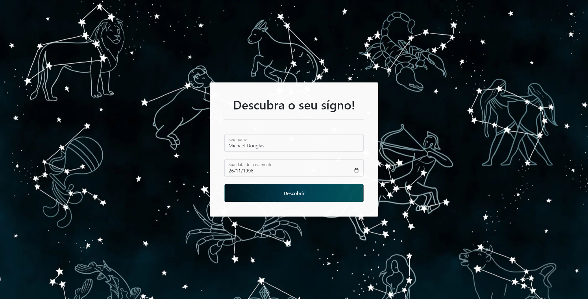
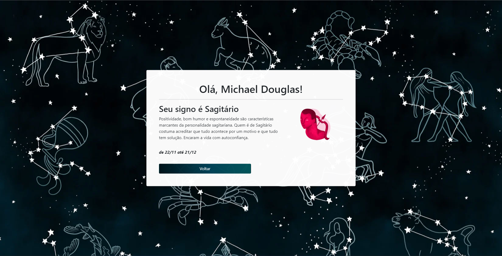

# Fórum de Dev Web - Unopar

## Como rodar
- É preciso ter pelo menos o PHP instalado
- Clonar o projeto ou fazer o download
- Opção 1: executar no terminal `php -S localhost:8000` no mesmo diretório do projeto
- Opção 2: caso use o xamp para rodar o apache, pode mover a posta do projeto para dentro de `C:\xamp\htdocs`

## Requisitos da atividade:
- Criar um arquivo XML contendo a seguinte estrutura de cada signo: 
  - dataInicio
  - dataFim
  - nomeSigno
  - descricao
  
- Desenvolver uma página web contendo um formulário onde o usuário poderá inserir sua data de nascimento e ao clicar no submit deve ser redirecionado para uma página que contém as informações principais do seu signo.

- Abrir o arquivo XML e iterar todos os elementos para buscar qual o signo do usuário, usando sua data de aniversário.

## Página inicial que contém o formulário
- O index.php é onde fica o formulário para o usuário informar seus dados

- Após clicar em "Descobrir", é redirecionado para o arquivo logica.php

## Página que apresenta o signo ao usuário

- No logica.php é onde acontece o processo para descobrir qual o signo do usuário

- Após todo o processo, no final é incluido o arquivo mostrar-signo.php 

